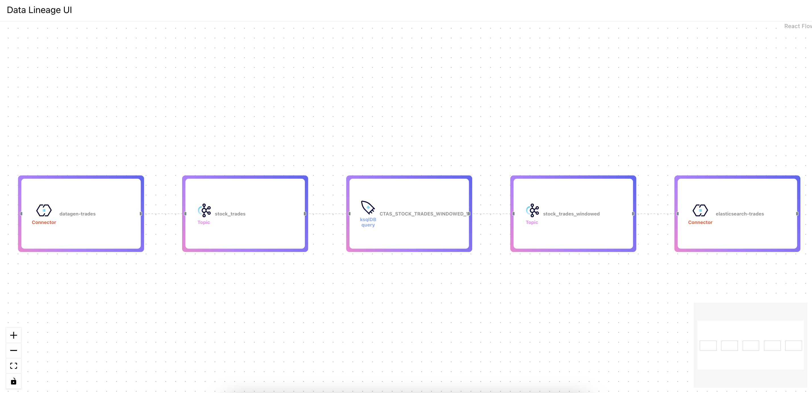

# Kafka Data Lineage

This project is an attempt to provide a data lineage visualization for on-premise usage. It's based on [Confluent Audit Logs](https://docs.confluent.io/platform/current/security/audit-logs/audit-logs-concepts.html). The aim is to visualize consumer/producer as [Stream Lineage](https://docs.confluent.io/cloud/current/stream-governance/stream-lineage.html#summary-of-navigation-paths) can do with [Confluent Cloud](https://www.confluent.io/confluent-cloud/). 

**Disclaimer : It's an expiremental product (aka POC) developed during my free time. **

# How to start ? 

``` bash
./start.sh
```

This script will be deploy this stack :

| Service  | Component  | Port forwarding  |  Comment  |
|---|---|---|---|
| broker  | [Confluent Server](https://docs.confluent.io/platform/current/installation/available_packages.html#confluent-server)  | 19094  | SASL_PLAINTEXT:19094  |
| zookeeper  | Zookeeper  | 22181  | ZOOKEEPER_CLIENT_PORT = 22181  |
| zookeeper-add-kafka-users  | /  | /  | Used at the beginning to create multiple kafka users  |
| schema-registry  | [Confluent Schema Registry](https://docs.confluent.io/platform/current/schema-registry/index.html)  | 8081  | Provide a serving layer for your metadata  |
| connect  | Kafka Connect  | 8083  | `elasticsearch`, `activemq`, `activemq-sink` and `datagen` connectors are already installed  |
| ksqldb-server  | [Confluent KsqlDB](https://www.confluent.io/product/ksqldb/?utm_medium=sem&utm_source=google&utm_campaign=ch.sem_br.nonbrand_tp.prs_tgt.kafka_mt.xct_rgn.namer_lng.eng_dv.all_con.kafka-ksql&utm_term=ksqldb&creative=&device=c&placement=&gclid=Cj0KCQiAmaibBhCAARIsAKUlaKQeVOUGaFF1R6X9kII8WSjlXRss8WEap1o12Xl8PspVIGTTSspJ6XkaAvDEEALw_wcB)  | 8088  | /  |
| ksqldb-cli  | Ksqldb CLI |  /  | Used for deploying ksqldb queries   |
| control-center | [Confluent Control Center](https://docs.confluent.io/platform/current/control-center/index.html) |  9021  | A web-based tool for managing and monitoring Apache Kafka®.  |
| elasticsearch | Elasticsearch |  9300,9200  | Used in downstream system for persisting an aggregation from a Kafka topic |
| data-lineage-forwarder | Data Lineage Forwarder |  /  | A Kafka Streams application which route audit logs event into multiple topics (fetch, produce, dlq) |
| data-lineage-api | Data Lineage API |  8080  | A Kafka Streams application which aggregate events and expose a lineage graph API. You can see the swagger contract at http://localhost:8080/swagger-ui.html |
| data-lineage-ui | Data Lineage UI |  80 | A simple React UI which materalize the lineage graph with [react-flow](https://reactflow.dev/) package |

When the script is done, you must see in the logs this line :

``` logs
[...]
🚀 All the stack is running, feel free to go on http://localhost:80. Enjoy your visualization ! 🎉 
```

Go at http://localhost, and you can visualize your data lineage dashboard.



If you try to delete the sink elastic connector, you could see the dashboard instantly updated.

``` bash
curl -X DELETE http://localhost:8083/connectors/elasticsearch-trades
```

# How to stop ? 

``` bash
./stop.sh
```

# TODO List
- [ ] Manage Kafka Streams application
- [ ] Manage inactive producer
- [ ] Add some metadatas for each node (user, schemas, throughput, etc ..)